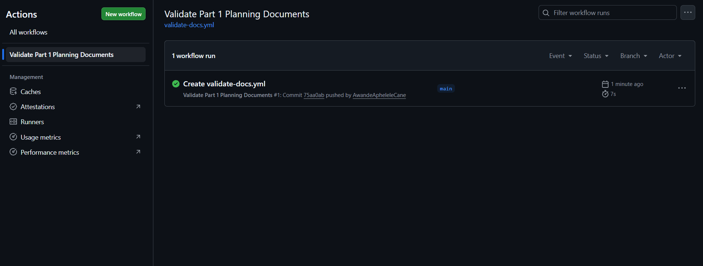

# Race-Day-ST10447692
Portfolio of Evidence (PoE) PART 1 (ASSIGNMENT 1) PROG6212w SEMESTER 2
# RaceDay – Part 1: System Planning and Database

## Short Description
RaceDay is a full-stack web-based event management system designed for the South African road running, walking, and cycling community.  
This repository contains **Part 1** of the project, which focuses purely on system planning and database design before any application code is written.

In this part I delivered:
- A complete Entity Relationship Diagram (ERD)
- A full API Endpoint Plan
- A working SQL Server script that creates the database schema and seeds realistic sample data

## User Roles
The system supports two distinct roles:

- **Organiser**  
  Can create, edit, and delete events, manage event categories, capture participant results, and view all event enrolments.

- **Participant**  
  Can create an account, browse upcoming events, enter an event by selecting a category, view their own enrolments, and track their personal results.

## Documentation (Part 1)
All planning documents are located in the `/docs` folder:

- `RaceDay_ERD.png` – Entity Relationship Diagram
- `API_Endpoint_Plan.md` – Complete list of planned API endpoints
- `RaceDay_Schema_and_Seed.sql` – Full database creation and seed script

## CI/CD
A GitHub Actions workflow has been configured to validate that all required Part 1 files exist in the repository.

**Successful build screenshot:**

<!-- Drag and drop your green CI/CD screenshot below this line -->

## Video Presentation
Watch the Part 1 walkthrough video here:  
[Part 1 Video – RaceDay Planning & Database](https://youtu.be/_3KBAdNk4aU)

## How to Run the SQL Script
1. Open SQL Server Management Studio (SSMS)
2. Connect to your local SQL Server instance
3. Open the file `docs/RaceDay_Schema_and_Seed.sql`
4. Execute the script (F5)
5. The `RaceDay` database will be created with sample data

---
**Student:** Awande Aphelele Cane  
**Module:** PROG6212w  
**Part:** 1 of 3
